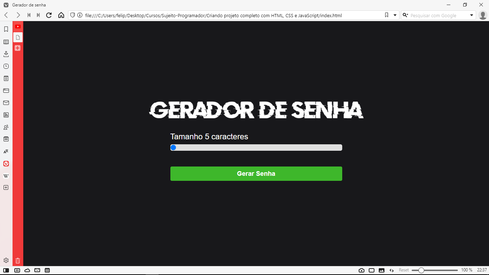

<h1 align="center">Criando um gerador de senha</h1>

<h2 align="center">Link do vídeo: https://www.youtube.com/watch?v=i6t2jaRxos4</h2>

<h3 align="center">Tecnologias usadas:</h3>

- HTML
- CSS
- JS(Agora estou fazendo projetos com JS para aprender a linguagem. É uma linguagem extremamente boa!)